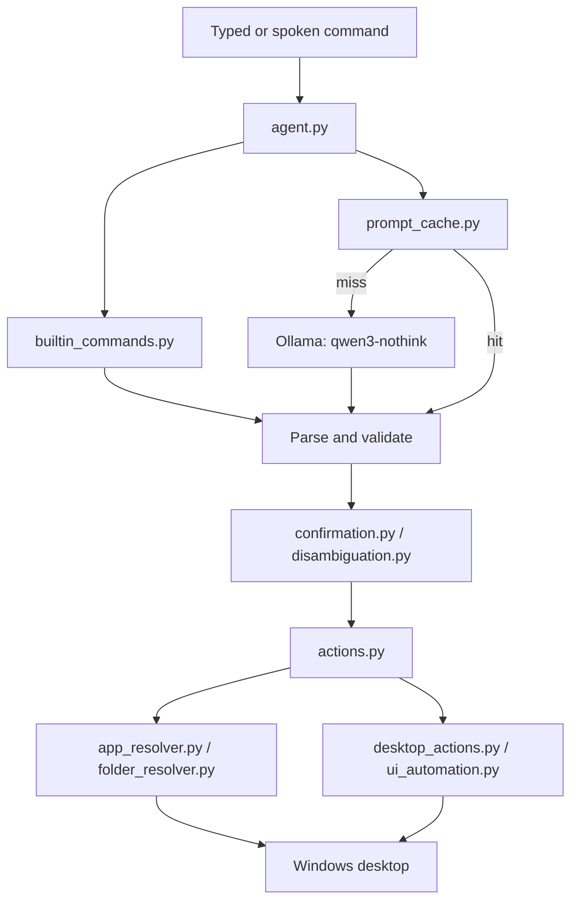

# Personal Agent

A local-first Windows desktop agent that turns typed or spoken natural-language commands into validated actions and executes them through trusted Python code. The language model runs locally through Ollama; it never receives direct control of the desktop.

All implementation files are in [`personal-agent`](personal-agent/). The project is a Windows desktop prototype, not a hosted service.

## What It Does

- Launches, focuses, and closes Windows applications.
- Opens known or custom folders.
- Finds visible controls with OCR and clicks them.
- Falls back to Windows UI Automation for icon-only accessible controls.
- Types text, presses keys or shortcuts, scrolls, waits, takes screenshots, and reports screen colors.
- Runs multi-step requests as ordered sequences of up to 12 actions.
- Uses exact prompt caching, destructive-action confirmation, and ambiguous-click selection.
- Supports wake-word voice input with Faster Whisper and spoken replies with `pyttsx3`.
- Includes an optional always-on-top looping video pet.

## Architecture



`agent.py` owns the CLI and model boundary. It parses and validates only an allowlisted action contract before `actions.py` performs an operation. Voice mode uses the same `process_command()` path as typed mode. `video_pet.py` is an independent optional overlay and does not need to be started for the agent to work.

## Project Map

| File | Responsibility |
| --- | --- |
| [`agent.py`](personal-agent/agent.py) | CLI, Ollama calls, response parsing, validation, sequences, confirmation, and voice entry points. |
| [`actions.py`](personal-agent/actions.py) | Trusted action dispatcher and desktop action handlers. |
| [`builtin_commands.py`](personal-agent/builtin_commands.py) | Deterministic shortcuts handled without the model. |
| [`app_resolver.py`](personal-agent/app_resolver.py) | Finds apps through cached paths, known locations, Start Menu, `PATH`, app registration, and registry entries. |
| [`folder_resolver.py`](personal-agent/folder_resolver.py) | Resolves known folders and searches user locations or fixed drives for custom folders. |
| [`desktop_actions.py`](personal-agent/desktop_actions.py) | Window focus, OCR, simulated input, screenshots, scrolling, and color lookup. |
| [`ui_automation.py`](personal-agent/ui_automation.py) | Bounded Windows UI Automation fallback for accessible controls. |
| [`color_vision.py`](personal-agent/color_vision.py) | Color naming and color-based click disambiguation. |
| [`confirmation.py`](personal-agent/confirmation.py) | 30-second yes/no gate for closing windows and quit/close shortcuts. |
| [`disambiguation.py`](personal-agent/disambiguation.py) | Numbered selection when OCR finds multiple likely targets. |
| [`voice_io.py`](personal-agent/voice_io.py) | Microphone capture, wake word, Faster Whisper, TTS, state, and voice logs. |
| [`video_pet.py`](personal-agent/video_pet.py) | Optional Tkinter/PyAV video overlay using `pet_video.mp4`. |
| [`prompt_cache.py`](personal-agent/prompt_cache.py) | Exact normalized prompt-to-action cache. |
| [`Modelfile`](personal-agent/Modelfile) | Ollama recipe for `qwen3-nothink`. |
| [`CODEBASE_WALKTHROUGH.md`](personal-agent/CODEBASE_WALKTHROUGH.md) | Detailed implementation walkthrough. |

`brain.py` and `config.py` are currently empty placeholders. The standalone test scripts are intentionally simple Python programs rather than a pytest suite.

## Requirements

- Windows 10 or 11.
- Python 3.10 or newer.
- Ollama running locally with `qwen3:4b` available.
- Tesseract OCR at `C:\Program Files\Tesseract-OCR\tesseract.exe`, or update the path in `desktop_actions.py`.
- A microphone and working Windows audio backend for voice mode.
- Tkinter and the bundled media files for the optional pet.

`requirements.txt` currently declares `uiautomation` only. The runtime also imports `ollama`, `pyautogui`, `pytesseract`, `pygetwindow`, `Pillow`, `numpy`, `SpeechRecognition`, `pyttsx3`, `faster-whisper`, `PyAudio`, and `av`; install those explicitly until the requirements file is expanded and pinned.

## Installation

From PowerShell:

```powershell
cd C:\Users\<user>\OneDrive\Desktop\Agent\personal-agent
python -m venv .venv
.\.venv\Scripts\Activate.ps1
python -m pip install --upgrade pip
python -m pip install -r requirements.txt
python -m pip install ollama pyautogui pytesseract pygetwindow pillow numpy SpeechRecognition pyttsx3 faster-whisper PyAudio av
```

Install Ollama, then create the model expected by `agent.py`:

```powershell
ollama pull qwen3:4b
ollama create qwen3-nothink -f Modelfile
ollama list
```

The model name is hard-coded as `qwen3-nothink`. `Modelfile` limits generation to 80 tokens, while the runtime request asks Ollama for up to 512; this is an existing configuration mismatch to review before production use.

## Run It

Run commands from `personal-agent`:

```powershell
python agent.py
```

Examples:

```text
open brave
focus spotify
click search
type youtube.com
press enter
wait 2
open brave, wait 2, press ctrl+l, type youtube.com, press enter
```

Type `exit`, `quit`, `stop`, or `bye` to leave typed mode. Use `forget <phrase>` to remove a cached classification.

Voice mode:

```powershell
python agent.py --voice
python agent.py --list-mics
python agent.py --mic 5 --voice
```

Say `agent` followed by a command, or use a direct command beginning with `open`, `launch`, `click`, `type`, or `press`. Stop continuous voice mode with `Ctrl+C` or by closing the terminal.

Optional pet, in a second PowerShell window:

```powershell
python video_pet.py
```

The pet loops the bundled video and exits independently; `agent.py` can also launch it during startup depending on the current runtime path.

## Action Contract

Validated actions are `open_app`, `open_folder`, `focus_app`, `close_app`, `click_text`, `type_text`, `press_key`, `scroll`, `screenshot`, `get_color`, and `wait`.

Examples:

```json
{"action":"open_app","target":"brave"}
{"action":"open_folder","target":"downloads"}
{"action":"click_text","target":"red submit"}
{"action":"press_key","target":"ctrl+l"}
{"action":"wait","target":2}
```

Sequences are emitted as `{"steps":[...]}` or as a bare JSON array. Each step uses the same action contract. Targets must be non-empty strings except for `close_app`, `screenshot`, and `get_color`; `wait` accepts a non-negative number. Unknown actions and malformed targets are rejected locally.

Destructive actions are held for 30 seconds and require `yes` or a similar affirmation. `no`, `cancel`, or an unrelated response cancels or abandons the pending action. When OCR finds rival matches, the agent reports numbered candidates with position and sometimes color, then resumes after the user selects one.

## Caches and Runtime Files

- `app_paths.json`: resolved application paths, verification dates, and launch counts.
- `folder_paths.json`: custom folder paths and access counts.
- `prompt_cache.json`: exact normalized prompts and validated actions.
- `agent_state.json`: current state such as `idle`, `listening`, `thinking`, or `speaking`.
- `voice_log.json`: recognized speech, commands, and spoken responses.

These JSON files are machine-specific runtime data and may contain local paths or personal voice history. They are read-modify-written without locking; remove stale entries when applications or folders move, and review them before sharing the project.

## Diagnostics

```powershell
python test_confirmation.py
python test_disambiguation.py
python test_empty_command.py
python test_sequence.py
python test_resolver.py
python record_test.py
python actions.py
```

The first four are focused standalone tests. `test_resolver.py` is interactive. `record_test.py` creates `test_recording.wav`; use it to separate microphone problems from transcription problems. `actions.py` provides a manual action-layer check and may control the desktop.

For model failures, run `ollama list` and verify `qwen3-nothink`. For OCR failures, verify the Tesseract path. For microphone failures, list devices, record a sample, check Windows permissions, and retry with `--mic <index>`.

## Safety and Limitations

- Simulated clicks, typing, and key presses affect the globally focused Windows desktop.
- The agent refocuses the tracked application and refuses input actions if that app is no longer running.
- OCR is limited to the focused window and can miss small, stylized, or changing content.
- Folder full-drive fallback scans can be slow.
- There is no authentication, remote API, multi-user isolation, sandbox, durable memory, or true undo.

For a deeper module-by-module explanation, see [`CODEBASE_WALKTHROUGH.md`](personal-agent/CODEBASE_WALKTHROUGH.md).
