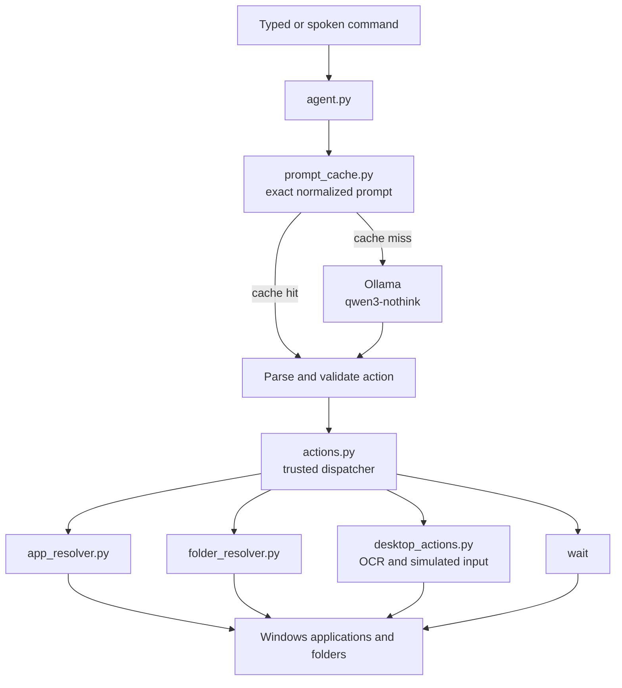
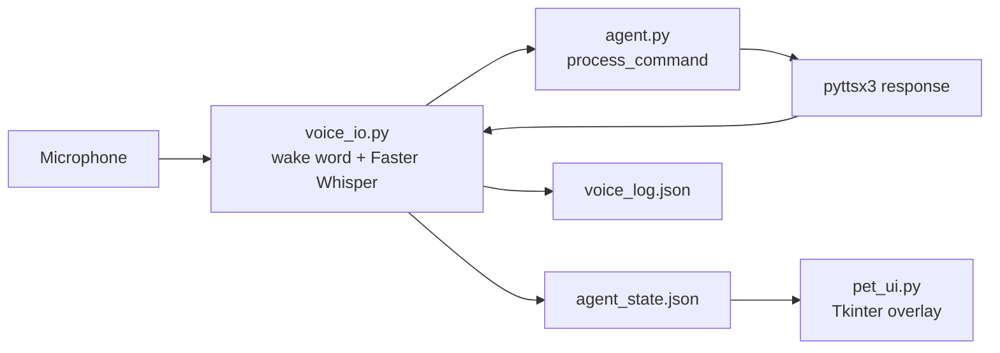

# Personal Agent

A local-first Windows desktop agent that converts typed or spoken commands into structured actions and executes them on the computer. The language model runs locally through Ollama; Python remains the trusted execution layer.

## Current Capabilities

- Open installed applications by name.
- Open Windows special folders and user folders.
- Focus an already-running application window.
- Find visible text with OCR and click it.
- Type text into the focused application.
- Press individual keys or combinations such as `ctrl+s` and `alt+left`.
- Wait between actions.
- Use a strict prompt cache to avoid repeating identical LLM requests.
- Run by keyboard or with a wake-word voice loop.
- Display agent state in a small always-on-top desktop pet.

The agent is designed for Windows and currently executes one structured action per command.

## Architecture



The model does not directly control Windows. It is asked for one JSON action, `agent.py` validates that action against an allowlist, and `actions.py` performs the local operation.

Voice mode and the optional desktop pet use a small JSON file as their shared state channel:



## Project Layout

All source code is in [`personal-agent`](personal-agent/).

| File | Purpose |
| --- | --- |
| [`agent.py`](personal-agent/agent.py) | Main CLI, Ollama integration, JSON cleanup/validation, text and voice mode entry points. |
| [`actions.py`](personal-agent/actions.py) | Trusted action dispatcher and handlers. |
| [`app_resolver.py`](personal-agent/app_resolver.py) | Finds applications through known paths, Start Menu shortcuts, `PATH`, Windows app registration, and the uninstall registry. |
| [`folder_resolver.py`](personal-agent/folder_resolver.py) | Resolves known Windows folders and searches common locations or fixed drives for custom folders. |
| [`desktop_actions.py`](personal-agent/desktop_actions.py) | Window focus, OCR text lookup, mouse clicks, typing, key presses, and delays. |
| [`voice_io.py`](personal-agent/voice_io.py) | Wake-word detection, microphone capture, Faster Whisper transcription, TTS, state updates, and voice logging. |
| [`pet_ui.py`](personal-agent/pet_ui.py) | Optional Tkinter overlay that polls `agent_state.json` and reflects idle/listening/thinking/speaking states. |
| [`prompt_cache.py`](personal-agent/prompt_cache.py) | Exact normalized prompt to action cache. |
| [`Modelfile`](personal-agent/Modelfile) | Ollama recipe for the strict JSON-only `qwen3-nothink` model. |
| [`test_resolver.py`](personal-agent/test_resolver.py) | Interactive application resolver test. |
| [`record_test.py`](personal-agent/record_test.py) | Records a short WAV file to verify microphone capture. |
| [`list_mics.py`](personal-agent/list_mics.py) | Lists microphone device names and indices. |
| [`CODEBASE_WALKTHROUGH.md`](personal-agent/CODEBASE_WALKTHROUGH.md) | Earlier internal walkthrough; this README documents the current implementation. |

`brain.py` and `config.py` are currently empty placeholders. `requirements.txt` is also empty, so install the dependencies listed below manually or add pinned versions before distributing the project.

## Requirements

- Windows 10 or Windows 11.
- Python 3.10 or newer. The code uses modern union type syntax such as `str | None`.
- Ollama installed and running locally for normal agent commands.
- The `qwen3:4b` Ollama model available locally.
- Tesseract OCR installed at the path currently configured in `desktop_actions.py`:
  `C:\Program Files\Tesseract-OCR\tesseract.exe`
- A working microphone for voice mode.
- A usable audio backend for `SpeechRecognition` (usually PyAudio on Windows).

## Installation

Open PowerShell in the `personal-agent` directory:

```powershell
cd C:\Users\<user>\OneDrive\Desktop\Agent\personal-agent
python -m venv .venv
.\.venv\Scripts\Activate.ps1
```

Install the Python packages imported by the project:

```powershell
python -m pip install --upgrade pip
python -m pip install ollama pyautogui pytesseract pygetwindow pillow numpy SpeechRecognition pyttsx3 faster-whisper PyAudio
```

If `PyAudio` fails to build on Windows, install a compatible prebuilt wheel or use the audio backend supported by your Python version, then rerun the installation.

Install and start Ollama, then create the model used by `agent.py`:

```powershell
ollama pull qwen3:4b
ollama create qwen3-nothink -f Modelfile
ollama list
```

The model name is hard-coded as `qwen3-nothink` in `agent.py`. If you use another model, update both the model setup and that constant.

## Running the Agent

### Typed mode

```powershell
python agent.py
```

Examples:

```text
open brave
open downloads
focus spotify
click search
type youtube.com
press enter
wait 2
```

Exit typed mode with `exit`, `quit`, `stop`, or `bye`.

To remove a cached classification that was wrong:

```text
forget open brave
```

### Voice mode

```powershell
python agent.py --voice
```

Say `agent` followed by a command, or say a direct command beginning with words such as `open`, `launch`, `click`, `type`, or `press`. The wake-word matcher also accepts common transcription aliases such as `asian`, `ancient`, and `urgent`.

List audio input devices:

```powershell
python agent.py --list-mics
```

Use a specific microphone device:

```powershell
python agent.py --mic 5 --voice
```

The default microphone setting is `None`, which follows the Windows default input device. Voice mode calibrates ambient noise, performs a short microphone check, filters likely Whisper hallucinations, and speaks responses with `pyttsx3`.

### Desktop pet

Run the optional overlay in a second PowerShell window from `personal-agent`:

```powershell
python pet_ui.py
```

Then run `python agent.py --voice` in the first window. The pet reads `agent_state.json`; it does not communicate with the agent over sockets or shared memory.

### Diagnostics

Test application resolution:

```powershell
python test_resolver.py
```

Inside the resolver test, enter an application name, `rescan <name>`, or `forget <name>`.

Test microphone capture without Whisper or wake-word logic:

```powershell
python record_test.py
```

This creates `test_recording.wav` in the current directory. Play it back to distinguish a microphone/device problem from a transcription problem.

Test the action layer without Ollama:

```powershell
python actions.py
```

The manual action test accepts prefixes such as `app`, `folder`, `focus`, `click`, `type`, `key`, and `wait`.

## Supported Action Contract

The model output must be one JSON object with an allowlisted `action` and an appropriate `target`:

```json
{"action":"open_app","target":"brave"}
{"action":"open_folder","target":"downloads"}
{"action":"focus_app","target":"spotify"}
{"action":"click_text","target":"search"}
{"action":"type_text","target":"youtube.com"}
{"action":"press_key","target":"ctrl+l"}
{"action":"wait","target":2}
```

`agent.py` rejects unknown actions, missing targets, negative waits, and non-numeric wait values. The Ollama request uses JSON output formatting, temperature `0`, a prediction limit of `80`, and a context limit of `4096`.

## Resolution and Caching

Application lookup uses this order:

1. Existing valid entry in `app_paths.json`.
2. Known installation locations.
3. Windows Start Menu shortcuts.
4. Executables on `PATH`.
5. Windows `Get-StartApps`.
6. Uninstall registry entries.

Folder lookup uses this order:

1. Built-in Windows folders such as Desktop, Documents, Downloads, Pictures, Music, Videos, Home, and AppData.
2. Existing valid entry in `folder_paths.json`.
3. Desktop, Documents, Downloads, and the user home directory.
4. A full scan of fixed drives as a last resort.

Repeated prompts are stored in `prompt_cache.json` after validation. Matching is intentionally exact after lowercasing, trimming, and collapsing whitespace. This avoids executing a wrong action because of an overly broad fuzzy cache hit.

The JSON files are runtime state, not source configuration:

- `app_paths.json`: resolved app launch targets and launch counts.
- `folder_paths.json`: resolved folder paths and access counts.
- `prompt_cache.json`: prompt-to-action mappings and hit counts.
- `agent_state.json`: current UI/voice state and timestamp.
- `voice_log.json`: recognized speech and spoken responses.

These files can contain machine-specific paths and personal activity. Review them before sharing or committing them.

## Safety and Limitations

- `click_text`, `type_text`, and `press_key` operate through simulated desktop input. They first try to refocus the tracked application and refuse to act if that window is no longer running.
- OCR searches the active window and clicks the first matching word. It can fail with small, stylized, or ambiguous text.
- `os.startfile` launches whatever path a resolver returns. Resolver caches should be treated as local machine state and cleared when applications or folders move.
- A custom folder miss can trigger a full fixed-drive scan and may be slow.
- Voice mode is continuous. `exit` spoken as a command produces a response but does not terminate the voice loop; close the terminal or press `Ctrl+C` to stop it.
- The Tesseract executable path is currently hard-coded for the default Windows installation location.
- There is no authentication, remote control API, confirmation dialog, undo system, or multi-user isolation.
- `requirements.txt` does not yet pin or declare dependencies.

## Troubleshooting

### Ollama or model errors

Confirm Ollama is running and the model exists:

```powershell
ollama list
ollama run qwen3-nothink
```

The agent expects the exact model name `qwen3-nothink`.

### OCR errors

Install Tesseract OCR and verify that this file exists:

```text
C:\Program Files\Tesseract-OCR\tesseract.exe
```

If it is installed elsewhere, update `pytesseract.pytesseract.tesseract_cmd` in `desktop_actions.py`.

### Voice mode hears nothing

1. Run `python agent.py --list-mics`.
2. Run `python record_test.py` and listen to `test_recording.wav`.
3. Set the correct device index with `python agent.py --mic <index> --voice`.
4. Check Windows microphone permissions, mute state, and input volume.
5. Speak close to the selected microphone during the initial mic check.

### An app or folder cannot be found

Use the standalone resolver tests. For a stale cached result, use `rescan <name>` or remove the corresponding entry from `app_paths.json` or `folder_paths.json`.

## Development Notes

The central extension point for new behavior is the action contract:

1. Add the action name and output rules to the system prompt in `agent.py`.
2. Add it to `ALLOWED_ACTIONS`.
3. Validate its target in `validate_action()`.
4. Implement and dispatch it in `actions.py`.
5. Add focused tests or a manual diagnostic path.

Keep the model responsible for intent classification and local Python responsible for validation, resolution, and execution.
