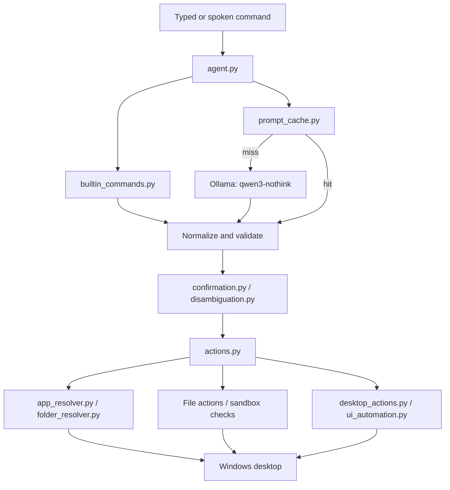

# Personal Agent

A local-first Windows desktop agent that turns typed or spoken natural-language
commands into validated actions and executes them through trusted Python code.
The language model runs locally through Ollama; it does not receive direct
control of the desktop.

The implementation lives in [`personal-agent`](personal-agent/). This is a
Windows desktop prototype, not a hosted service.

## Capabilities

- Launch, focus, and close Windows applications.
- Open known folders and resolve custom folders.
- Copy and move files with path checks, overwrite protection, and undo support.
- Find visible controls with OCR and click or right-click them.
- Fall back to Windows UI Automation for accessible, icon-only controls.
- Type text, press keys and shortcuts, scroll, wait, take screenshots, and read
  screen colors.
- Run ordered multi-step requests.
- Handle common commands deterministically without an LLM call.
- Cache validated prompt classifications for repeat commands.
- Require confirmation before destructive window or quit actions.
- Ask the user to disambiguate when several controls match.
- Accept wake-word voice input with Faster Whisper and provide spoken replies
  with `pyttsx3`.
- Show an optional always-on-top animated video pet.

## Architecture



The important safety boundary is that the model emits only a structured action
or sequence. Local Python code validates the action, applies confirmation and
path checks, and then performs the operation.

Command resolution follows this order:

1. Exact built-in command in [`builtin_commands.py`](personal-agent/builtin_commands.py).
2. Exact normalized prompt in [`prompt_cache.py`](personal-agent/prompt_cache.py).
3. Local Ollama model defined by [`Modelfile`](personal-agent/Modelfile).

Typed and voice input share the same processing pipeline, so validation,
caching, confirmation, and execution behave consistently.

## Repository map

### Runtime and orchestration

| File | Responsibility |
| --- | --- |
| [`agent.py`](personal-agent/agent.py) | CLI loop, Ollama boundary, JSON cleanup, validation, sequences, voice flags, and command orchestration. |
| [`actions.py`](personal-agent/actions.py) | Trusted dispatcher for desktop, file, and application actions. |
| [`builtin_commands.py`](personal-agent/builtin_commands.py) | Curated exact matches for editing, browser, media, volume, window, scrolling, and screenshot commands. |
| [`prompt_cache.py`](personal-agent/prompt_cache.py) | Normalizes prompts and stores validated prompt-to-action results. |
| [`confirmation.py`](personal-agent/confirmation.py) | Time-limited yes/no gate for destructive actions. |
| [`disambiguation.py`](personal-agent/disambiguation.py) | Numbered selection flow when OCR finds multiple candidates. |
| [`app_switch.py`](personal-agent/app_switch.py) | Pending state for Task View or app-switch picker requests. |
| [`voice_io.py`](personal-agent/voice_io.py) | Microphone capture, wake-word handling, Faster Whisper transcription, TTS, and voice state. |

### Desktop and resolution

| File | Responsibility |
| --- | --- |
| [`desktop_actions.py`](personal-agent/desktop_actions.py) | Focus tracking, OCR, mouse and keyboard simulation, scrolling, screenshots, and color lookup. |
| [`ui_automation.py`](personal-agent/ui_automation.py) | Windows UI Automation fallback for controls OCR cannot read. |
| [`color_vision.py`](personal-agent/color_vision.py) | Names screen colors and helps select a color-qualified OCR match. |
| [`app_resolver.py`](personal-agent/app_resolver.py) | Finds applications using cache, known locations, Start Menu, `PATH`, app registration, and registry entries. |
| [`folder_resolver.py`](personal-agent/folder_resolver.py) | Resolves known folders and searches user locations or drives for custom folders. |

### Optional UI and utilities

| File | Responsibility |
| --- | --- |
| [`video_pet.py`](personal-agent/video_pet.py) | Always-on-top looping video pet with background keying and optional audio. |
| [`pet_ui.py`](personal-agent/pet_ui.py) | Pet window and interaction UI helpers. |
| [`record_test.py`](personal-agent/record_test.py) | Records a WAV sample for microphone diagnostics. |
| [`list_mics.py`](personal-agent/list_mics.py) | Lists available microphone devices. |
| [`brain.py`](personal-agent/brain.py) | Placeholder for future separation of model logic. |
| [`config.py`](personal-agent/config.py) | Placeholder for future centralized settings. |

### Configuration and generated data

| File | Purpose |
| --- | --- |
| [`requirements.txt`](personal-agent/requirements.txt) | Declares the UI Automation dependency; other runtime dependencies are currently installed separately. |
| [`app_paths.json`](personal-agent/app_paths.json) | Machine-specific application path and launch cache. |
| [`folder_paths.json`](personal-agent/folder_paths.json) | Machine-specific custom-folder cache. |
| [`prompt_cache.json`](personal-agent/prompt_cache.json) | Cached normalized prompts and validated actions. |
| [`agent_state.json`](personal-agent/agent_state.json) | Current voice/agent state such as `idle`, `listening`, or `speaking`. |
| [`voice_log.json`](personal-agent/voice_log.json) | Recognized speech, commands, and spoken responses. |
| [`pet_video.mp4`](personal-agent/pet_video.mp4), [`pet_video_audio.wav`](personal-agent/pet_video_audio.wav) | Pet media assets. |
| `pet_sprite*.png`, `petui.jpg` | Pet artwork and preview assets. |

The JSON files are local runtime data. They can contain personal paths and voice
history and should be reviewed before sharing the repository.

### Current tree integration note

The current `actions.py` imports `context_memory` and `sandbox`, but those
modules are not present in this checkout. The file-management and desktop
runtime therefore require those modules to be restored or the imports and
calls to be completed before the agent can run end-to-end.

## Supported action contract

The validated action vocabulary includes:

```text
open_app, open_folder, focus_app, close_app,
click_text, right_click_text, click_at, move_to,
type_text, press_key, scroll, screenshot, get_color, wait,
copy_file, move_file, undo, switch_app_picker
```

Single actions use this shape:

```json
{"action":"open_app","target":"brave"}
```

File operations use source and destination paths:

```json
{"action":"copy_file","source":"Documents\\plan.docx","destination":"Desktop\\plan.docx"}
```

Multi-step requests are normalized from either a `steps` object or a bare JSON
array:

```json
{"steps":[
  {"action":"open_app","target":"brave"},
  {"action":"wait","target":2},
  {"action":"press_key","target":"ctrl+l"},
  {"action":"type_text","target":"youtube.com"},
  {"action":"press_key","target":"enter"}
]}
```

Targets must be non-empty strings except where an action explicitly permits an
empty target (`close_app`, `screenshot`, `get_color`, and
`switch_app_picker`). `wait` accepts a non-negative number. Unknown actions and
malformed fields are rejected before execution.

Closing an application and quit/close keyboard shortcuts are held for a
30-second confirmation window. OCR matches that remain ambiguous use the
disambiguation flow instead of clicking an arbitrary control.

## Requirements

- Windows 10 or 11.
- Python 3.10 or newer.
- Ollama with a local `qwen3:4b` model.
- Tesseract OCR at
  `C:\Program Files\Tesseract-OCR\tesseract.exe`, or a matching path configured
  in `desktop_actions.py`.
- A working microphone and Windows audio backend for voice mode.
- Tkinter and the bundled media files for the optional pet.

Runtime imports currently include `uiautomation`, `ollama`, `pyautogui`,
`pytesseract`, `pygetwindow`, `Pillow`, `numpy`, `SpeechRecognition`,
`pyttsx3`, `faster-whisper`, `PyAudio`, and `av`. Only `uiautomation` is listed
in `requirements.txt` at present, so the remaining packages must be installed
explicitly.

## Installation

From PowerShell:

```powershell
cd C:\Users\<user>\OneDrive\Desktop\Agent\personal-agent
python -m venv .venv
.\.venv\Scripts\Activate.ps1
python -m pip install --upgrade pip
python -m pip install -r requirements.txt
python -m pip install ollama pyautogui pytesseract pygetwindow pillow numpy SpeechRecognition pyttsx3 faster-whisper PyAudio av
```

Install Ollama, then create the model expected by `agent.py`:

```powershell
ollama pull qwen3:4b
ollama create qwen3-nothink -f Modelfile
ollama list
```

## Running the agent

Run commands from `personal-agent`:

```powershell
python agent.py
```

Examples:

```text
open brave
focus spotify
click search
type youtube.com
press enter
copy Documents\plan.docx to Desktop\plan.docx
move Desktop\old.txt to Documents\archive\old.txt
open brave, wait 2, press ctrl+l, type youtube.com, press enter
```

Type `exit`, `quit`, `stop`, or `bye` to leave typed mode. Use
`forget <phrase>` to remove a cached classification.

Voice mode:

```powershell
python agent.py --voice
python agent.py --list-mics
python agent.py --mic 5 --voice
```

Say the wake word followed by a command, or use a direct command beginning
with `open`, `launch`, `click`, `type`, or `press`.

To run the optional pet separately:

```powershell
python video_pet.py
```

## Tests and diagnostics

These are standalone scripts, not a pytest suite. Run them from
`personal-agent`:

```powershell
python test_confirmation.py
python test_disambiguation.py
python test_dry_run.py
python test_empty_command.py
python test_move_file.py
python test_move_file_confirmation.py
python test_move_file_simple.py
python test_move_file_validation.py
python test_resolver.py
python test_sanitization.py
python test_sequence.py
python test_undo.py
```

`test_resolver.py` is interactive. `record_test.py` creates a WAV sample for
separating microphone-capture issues from transcription issues. `actions.py`
also contains a manual action-layer check and may control the desktop.

For model failures, run `ollama list` and verify `qwen3-nothink`. For OCR
failures, verify the Tesseract path. For microphone failures, list devices,
record a sample, check Windows permissions, and retry with `--mic <index>`.

## Limitations and safety

- Simulated input affects the globally focused Windows desktop.
- The agent tracks the focused application and refuses input if it is no longer
  running rather than typing into an unrelated foreground window.
- OCR can miss small, stylized, dynamic, or inaccessible controls.
- Full-drive folder searches can be slow.
- File actions are local and path-checked, but this is not a security sandbox.
- There is no authentication, remote API, multi-user isolation, durable memory,
  or general undo for arbitrary desktop actions.
- The Ollama model and prompt configuration are local and machine-dependent.

For a deeper module-by-module explanation, see
[`personal-agent/CODEBASE_WALKTHROUGH.md`](personal-agent/CODEBASE_WALKTHROUGH.md).
