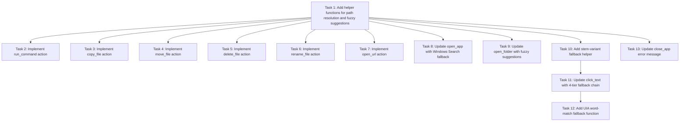

# Implementation Plan: Richer Actions

## Overview
This spec extends the Windows desktop AI agent with six new file and system actions (`copy_file`, `move_file`, `delete_file`, `rename_file`, `open_url`, `run_command`), smarter fallback strategies for existing actions (`open_app`, `open_folder`, `click_text`), and consistently actionable error messages across all actions. All file actions integrate with the security-safety spec's `sandbox.py` for path validation.

## Task Dependency Graph


```json
{
  "waves": [
    {
      "wave": 1,
      "tasks": [1],
      "description": "Foundation helpers for all subsequent tasks"
    },
    {
      "wave": 2,
      "tasks": [2, 3, 4, 5, 6, 7, 8, 9, 10, 13],
      "description": "Parallel execution: new actions (2-7), app/folder updates (8-9), stem helper (10), close_app message (13)"
    },
    {
      "wave": 3,
      "tasks": [11],
      "description": "click_text 4-tier fallback chain (depends on Task 10)"
    },
    {
      "wave": 4,
      "tasks": [12],
      "description": "UIA word-match function (depends on Task 11)"
    }
  ]
}
```

## Tasks

- [x] 1. **Add helper functions for path resolution and fuzzy suggestions** — Create `_resolve_path`, `_did_you_mean_app`, and `_did_you_mean_folder` in actions.py
  - **Requirements:** 1.3, 10.1, 10.2
  - **Files:** `actions.py`
  - **Description:** Implements path resolution against USERPROFILE for relative paths, and fuzzy matching (using difflib.SequenceMatcher with ratio ≥ 0.7) against app_paths.json keys and KNOWN_FOLDERS keys for "Did you mean?" suggestions.

- [x] 2. **Implement run_command action with whitelist and subprocess execution** — Add ALLOWED_COMMANDS constant and run_command function to actions.py
  - **Requirements:** 6.1, 6.2, 6.3, 6.4, 6.5, 6.6, 6.7, 7.8, 7.9
  - **Files:** `actions.py`, `agent.py`, `security_policy.py`
  - **Description:** Whitelists command prefixes (echo, dir, ipconfig, hostname, whoami, ver, date, time, ping, type), executes with subprocess.run(shell=False, timeout=10), captures and truncates output to 500 chars, returns specific error messages for blocked commands and timeouts. Add to ALLOWED_ACTIONS, system prompt, validate_action, and security_policy (always confirm).

- [x] 3. **Implement copy_file action with sandbox integration** — Add copy_file function with shutil.copy2/copytree to actions.py
  - **Requirements:** 1.1, 1.2, 1.4, 1.5, 1.6, 1.7, 1.8, 7.5, 7.6, 7.7, 7.10
  - **Files:** `actions.py`, `agent.py`, `security_policy.py`
  - **Description:** Calls _resolve_path on both paths, sandbox.check_path on both, checks source exists, detects destination collision, uses shutil.copy2 for files and shutil.copytree for directories preserving metadata, returns specific error messages. Add to ALLOWED_ACTIONS, system prompt, validate_action, and security_policy (never confirm).

- [x] 4. **Implement move_file action with sandbox integration** — Add move_file function with shutil.move to actions.py
  - **Requirements:** 2.1, 2.2, 2.4, 2.5, 2.6, 2.7, 7.5, 7.6, 7.10
  - **Files:** `actions.py`, `agent.py`, `security_policy.py`
  - **Description:** Calls _resolve_path and sandbox.check_path on both paths, checks source exists, uses shutil.move for both files and directories, returns specific error messages. Add to ALLOWED_ACTIONS, system prompt, validate_action, and security_policy (always confirm).

- [x] 5. **Implement delete_file action with sandbox and Recycle Bin support** — Add delete_file function with send2trash fallback to actions.py
  - **Requirements:** 3.1, 3.2, 3.4, 3.5, 3.6, 3.7, 3.8, 7.5, 7.6, 7.10
  - **Files:** `actions.py`, `agent.py`, `security_policy.py`
  - **Description:** Calls _resolve_path and sandbox.check_path, checks target exists, detects non-empty folders and requires "and contents" phrase, prefers send2trash over os.remove/shutil.rmtree with warning if unavailable, returns specific error messages. Add to ALLOWED_ACTIONS, system prompt, validate_action, and security_policy (always confirm).

- [-] 6. **Implement rename_file action with sandbox integration** — Add rename_file function with os.rename to actions.py
  - **Requirements:** 4.1, 4.2, 4.3, 4.4, 4.5, 4.6, 4.7, 7.5, 7.6, 7.10
  - **Files:** `actions.py`, `agent.py`, `security_policy.py`
  - **Description:** Constructs destination as parent/new_name, rejects new_name containing path separators or "..", calls _resolve_path and sandbox.check_path, checks target exists and destination doesn't exist, uses os.rename, returns specific error messages. Add to ALLOWED_ACTIONS, system prompt, validate_action, and security_policy (always confirm).

- [~] 7. **Implement open_url action with validation and browser integration** — Add open_url function with webbrowser.open to actions.py
  - **Requirements:** 5.1, 5.2, 5.3, 5.4, 5.5, 5.6, 7.10
  - **Files:** `actions.py`, `agent.py`
  - **Description:** Validates URL format (http(s):// prefix or bare domain pattern), prepends https:// to bare domains, opens with webbrowser.open without confirmation, returns specific error messages. Add to ALLOWED_ACTIONS, system prompt, validate_action, and security_policy (never confirm).

- [~] 8. **Update open_app with Windows Search fallback and "Did you mean?" suggestions** — Extend open_app function in actions.py with Win+S fallback tier
  - **Requirements:** 8.1, 8.2, 8.3, 8.4, 7.1, 10.1
  - **Files:** `actions.py`
  - **Description:** After find_app returns None (after force_rescan), attempts Win+S UI fallback (pyautogui: hotkey win+s, write app_name, press enter, wait 1.5s), then calls _did_you_mean_app for suggestions, returns updated not-found message with suggestion clause when ratio ≥ 0.7.

- [~] 9. **Update open_folder with "Did you mean?" suggestions** — Extend open_folder function in actions.py with fuzzy suggestions
  - **Requirements:** 7.2, 10.2
  - **Files:** `actions.py`
  - **Description:** After find_folder returns None (after force_rescan), calls _did_you_mean_folder for suggestions against KNOWN_FOLDERS, returns updated not-found message with suggestion clause when ratio ≥ 0.7.

- [~] 10. **Add stem-variant fallback helper to desktop_actions** — Create _stem_variants function in desktop_actions.py
  - **Requirements:** 9.1
  - **Files:** `desktop_actions.py`
  - **Description:** Generates morphological simplifications by stripping common English suffixes (ing, ed, s, er, ly) from the trailing word, plus ALL_CAPS and Title_Case forms. Deduplicates and limits to 6 variants, excluding the original.

- [~] 11. **Update click_text with 4-tier fallback chain** — Extend click_text function in desktop_actions.py with stem-variant and UIA word-match tiers
  - **Requirements:** 9.1, 9.2, 9.3, 9.4, 9.5, 7.3
  - **Files:** `desktop_actions.py`
  - **Description:** After existing Tier 1 (OCR find_text_matches) and Tier 2 (UIA find_control_center) fail, adds Tier 3 (stem-variant OCR retries using _stem_variants) and Tier 4 (UIA control-type word search using find_control_by_word). Returns updated not-found message with focused-app hint. Maintains disambiguation flow for multiple candidates at any tier.

- [~] 12. **Add UIA word-match fallback function to ui_automation** — Create find_control_by_word function in ui_automation.py
  - **Requirements:** 9.2
  - **Files:** `ui_automation.py`
  - **Description:** Returns (x, y) center of first clickable control (ButtonControl, HyperlinkControl, MenuItemControl) whose accessible Name contains any word from query as case-insensitive substring. Uses BFS walk with same budget constants as find_control_center. Returns None if UIA unavailable or no match found.

- [~] 13. **Update close_app error message for not-running case** — Extend close_app function in actions.py with actionable error message
  - **Requirements:** 7.4
  - **Files:** `actions.py`
  - **Description:** Detects "is not running" substring in _close_app result and returns updated message: "I couldn't close '<app>' — it doesn't appear to be running. Say 'open <app>' to launch it."

## Notes
- `sandbox.py` already exists from security-safety spec — import only, do not modify
- `agent.py` changes can be integrated per-task or batched — the tasks assume per-task integration
- Tasks 2-7 can execute in parallel after Task 1 completes
- Task 8-9 are independent and can execute in parallel after Task 1
- Task 10 must complete before Task 11, and Task 12 can execute in parallel with Task 11 or after Task 10
- Task 13 is independent and can execute any time after Task 1
- `send2trash` is an optional dependency — if unavailable, delete_file falls back to permanent deletion with a warning
- All new actions must be added to `ALLOWED_ACTIONS` in agent.py, described in the LLM system prompt, validated in `validate_action`, and integrated into `execute_action` dispatcher
- File action confirmation policy: move_file, delete_file, rename_file, and run_command are "always"; copy_file and open_url are "never"
