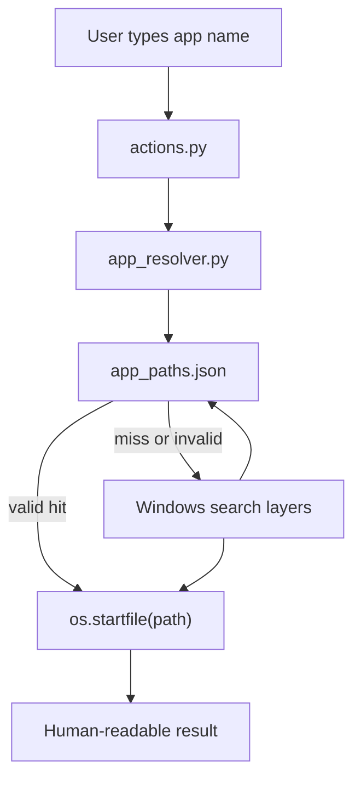
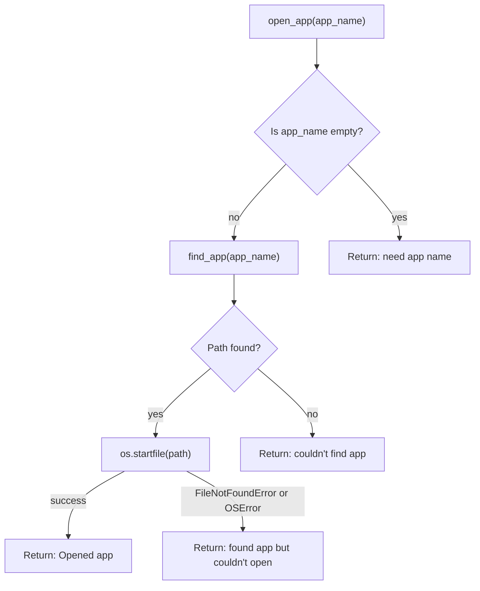
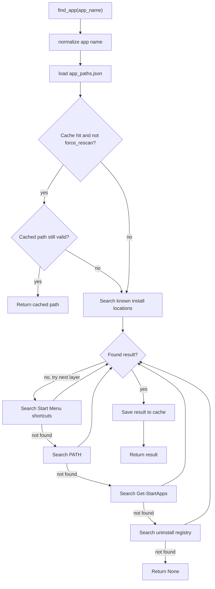
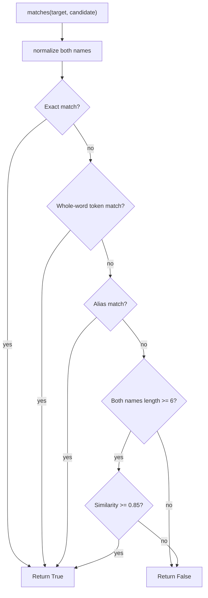
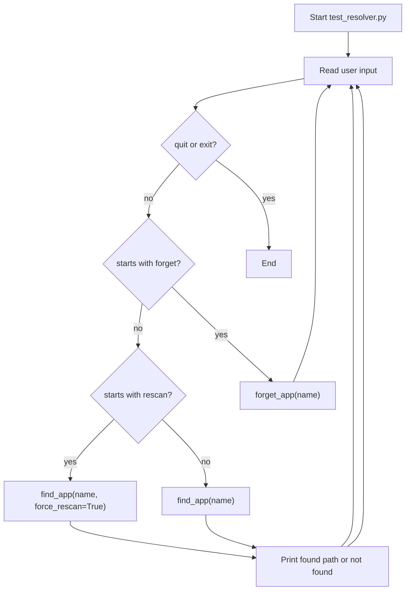
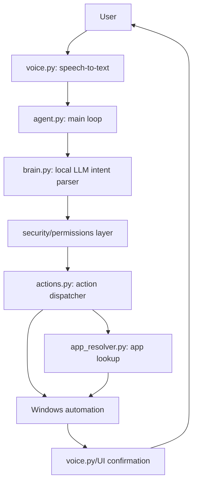
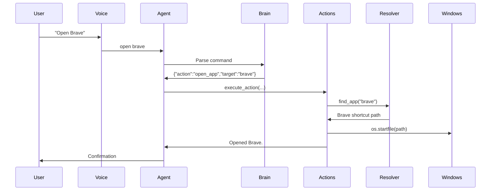

# Personal Agent Codebase Walkthrough

This repository is currently the beginning of a local-first Windows personal agent. The implemented part is a reliable application resolver and action executor for commands like:

```text
Open Brave
Open VS Code
Open Spotify
```

The voice, LLM brain, configuration, and main agent loop files exist as placeholders, but they do not contain logic yet.

## Current File Map

```text
personal-agent/
  actions.py          Executes structured actions, currently open_app.
  app_resolver.py     Finds installed Windows applications and caches paths.
  app_paths.json      Local cache of resolved app names to launch paths.
  test_resolver.py    Interactive CLI test for app lookup and cache behavior.
  agent.py            Empty placeholder for the future main agent loop.
  brain.py            Empty placeholder for local LLM parsing/planning.
  config.py           Empty placeholder for settings and paths.
  voice.py            Empty placeholder for speech input/output.
  requirements.txt    Empty placeholder for Python dependencies.
```

`__pycache__/` is generated Python bytecode and is not part of the source design.

## High-Level Current Flow



At this stage, the project does not yet listen to voice or call a local LLM. Instead, `actions.py` expects a structured dictionary that looks like something the future LLM will produce:

```python
{"action": "open_app", "target": "brave"}
```

## `actions.py`

`actions.py` is the action execution layer. Its job is to take a structured action and run the correct local Windows operation.

Implemented functions:

```python
open_app(app_name: str) -> str
execute_action(action: dict) -> str
```

### `open_app`

`open_app` takes an app name, asks `app_resolver.find_app()` to resolve it, and launches the result with `os.startfile()`.

It handles:

- Missing app names.
- Apps that cannot be found.
- Cached paths that no longer exist.
- Windows launch errors.

Flow:



### `execute_action`

`execute_action` is a dispatcher. Right now it only supports:

```python
{"action": "open_app", "target": "brave"}
```

If the action type is unknown, it returns:

```text
Unknown action: <action_type>
```

This is the right shape for the future system because the LLM should not directly control the computer. The LLM should produce structured intent, and this executor should decide what is actually allowed to run.

## `app_resolver.py`

`app_resolver.py` is the most complete module in the codebase. It turns a human app name into something Windows can launch.

Main public functions:

```python
find_app(app_name: str, force_rescan: bool = False)
forget_app(app_name: str)
```

Supporting functions:

```python
normalize_name(name)
matches(target, candidate)
search_known_locations(app_name)
search_start_menu(app_name)
search_path(app_name)
search_start_apps(app_name)
search_registry(app_name)
```

## App Resolution Flow



## Search Layers

The resolver searches from most reliable/fastest to broadest/fallback.

### 1. Cache

`app_paths.json` stores resolved app paths:

```json
{
  "brave": {
    "path": "C:\\ProgramData\\Microsoft\\Windows\\Start Menu\\Programs\\Brave.lnk",
    "last_verified": "2026-08-18",
    "launch_count": 4
  }
}
```

The cache improves speed after the first lookup. Each successful cached launch increments `launch_count`.

### 2. Known Install Locations

`KNOWN_LOCATIONS` stores special-case paths for apps that are often hard to discover, currently Visual Studio Code:

```python
"visual studio code": [
    r"%LOCALAPPDATA%\Programs\Microsoft VS Code\Code.exe",
    r"%PROGRAMFILES%\Microsoft VS Code\Code.exe",
    r"%PROGRAMFILES(X86)%\Microsoft VS Code\Code.exe",
]
```

### 3. Start Menu

The resolver scans Start Menu folders for `.lnk` and `.url` files:

```text
%APPDATA%\Microsoft\Windows\Start Menu\Programs
%PROGRAMDATA%\Microsoft\Windows\Start Menu\Programs
```

This is useful because many Windows apps are launchable through shortcuts even when their executable path is not obvious.

### 4. PATH

`search_path` uses `shutil.which()` to find command-line executables available in the Windows PATH.

### 5. Get-StartApps

`search_start_apps` runs PowerShell:

```powershell
Get-StartApps | ConvertTo-Json
```

If an app is found, it returns a launchable shell identifier:

```text
shell:AppsFolder\<AppID>
```

This helps with Microsoft Store/UWP-style apps.

### 6. Registry

`search_registry` checks uninstall registry entries for display names. This can confirm that an app is installed, but it may return only a display name rather than a launchable executable path. Because of that, it is correctly used as a last resort.

## Name Matching

The resolver has a custom `matches(target, candidate)` function to avoid bad fuzzy matches.

It checks in this order:



This is important because short app names can collide easily. For example, fuzzy matching could incorrectly match `brave` with `rave`, so the code only uses similarity fallback when both names are at least 6 characters long.

Current aliases:

```python
{
    "vs code": "visual studio code",
    "vscode": "visual studio code",
    "code": "visual studio code",
    "chrome": "google chrome",
    "word": "microsoft word",
    "excel": "microsoft excel",
    "powerpoint": "microsoft powerpoint",
    "ppt": "microsoft powerpoint",
}
```

## `test_resolver.py`

`test_resolver.py` is an interactive CLI tool for testing only the resolver.

Supported commands:

```text
<app name>          Resolve an app normally.
rescan <app name>   Ignore cache and search again.
forget <app name>   Remove the app from app_paths.json.
quit / exit         Stop the test program.
```

Flow:



## Current Cache Contents

`app_paths.json` currently contains cached entries for:

- Spotify
- Visual Studio
- VS Code
- fc
- Brave
- Chrome
- ChatGPT/Codex app

These cache entries are local to this Windows machine and should not be treated as portable configuration.

## Placeholder Files

These files currently exist but are empty:

```text
agent.py
brain.py
config.py
requirements.txt
voice.py
```

Expected future roles:

```text
agent.py       Main runtime loop: voice/text input -> brain -> actions -> response.
brain.py       Local LLM integration and structured action generation.
config.py      Model names, app settings, safety flags, storage paths.
voice.py       Local speech-to-text and text-to-speech.
requirements.txt Python dependencies.
```

## Intended Future Agent Flow

This is not implemented yet, but it matches the project direction:



For the MVP command `Open Brave`, the eventual flow should be:



## What Is Working Now

The current project can already:

- Resolve Windows applications by name.
- Cache discovered launch paths.
- Use aliases like `vs code` and `chrome`.
- Launch normal paths, shortcuts, URLs, and shell app identifiers.
- Forget cached apps.
- Force a rescan when needed.

## What Is Not Built Yet

The current project does not yet include:

- Voice recognition.
- Wake word detection.
- Local LLM calls.
- Planner logic beyond simple action dispatch.
- Floating desktop UI.
- OCR or screen understanding.
- Memory database.
- Skills/workflow recording.
- Sandbox mode.
- Permission levels.
- Audit logs.

## Recommended Next Build Step

The next useful step is to connect the existing executor to a tiny `agent.py` loop:

```text
User types command
  -> simple rule parser
  -> structured action
  -> execute_action
  -> print result
```

After that works, replace typed input with local speech-to-text, then replace the rule parser with a local LLM.

The codebase already has the right first brick: a practical Windows application resolver. The next job is to wrap it in an agent loop without making the system too large too early.
