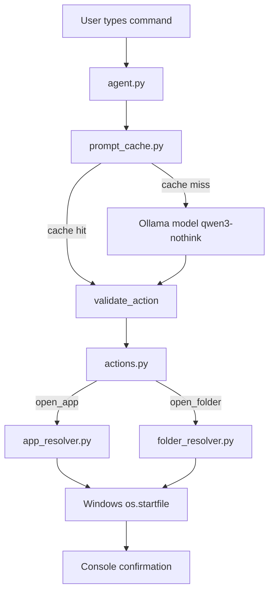
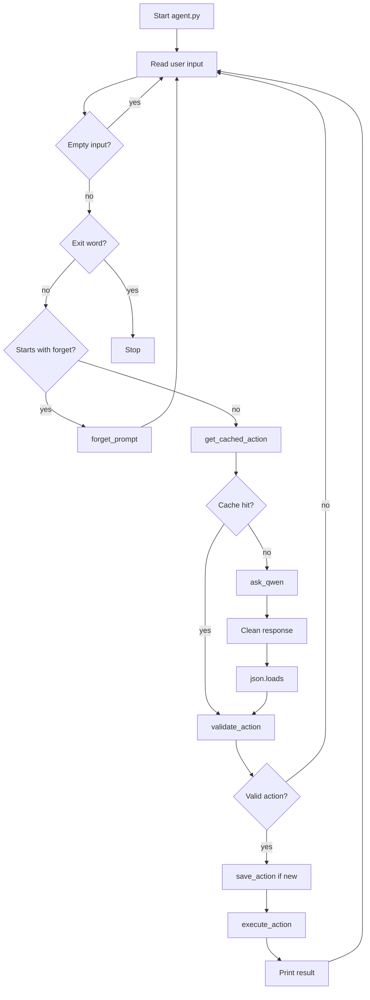
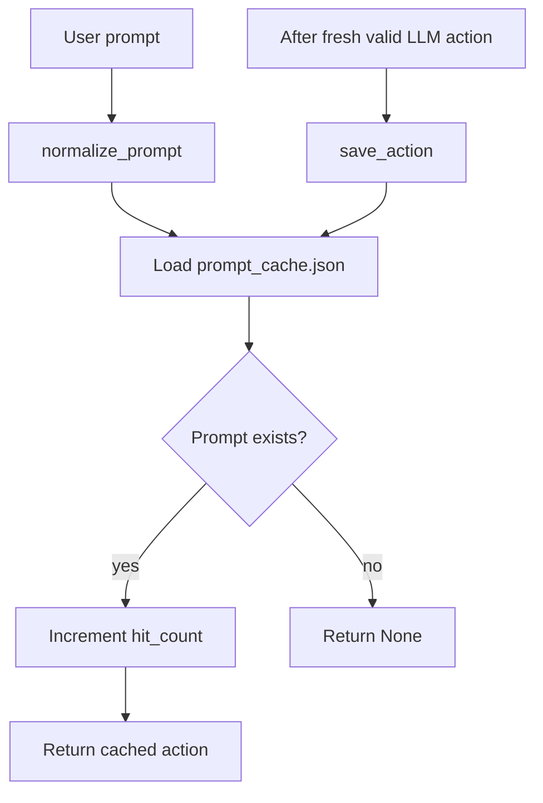
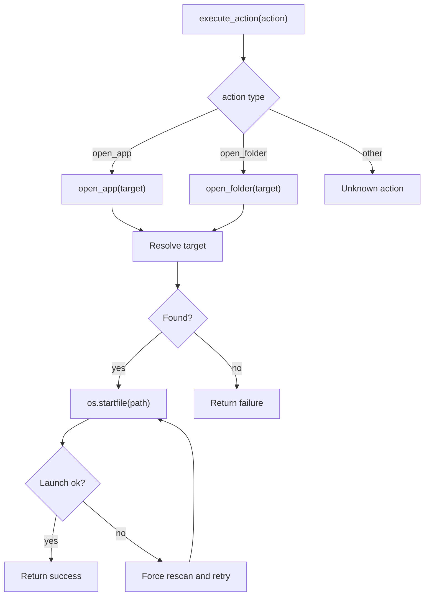
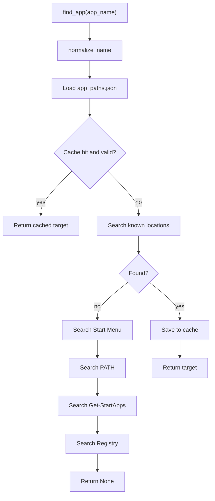
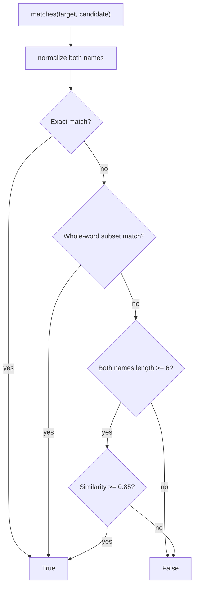
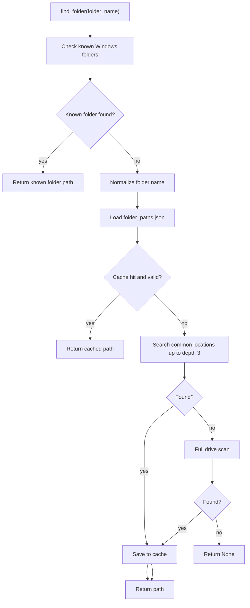
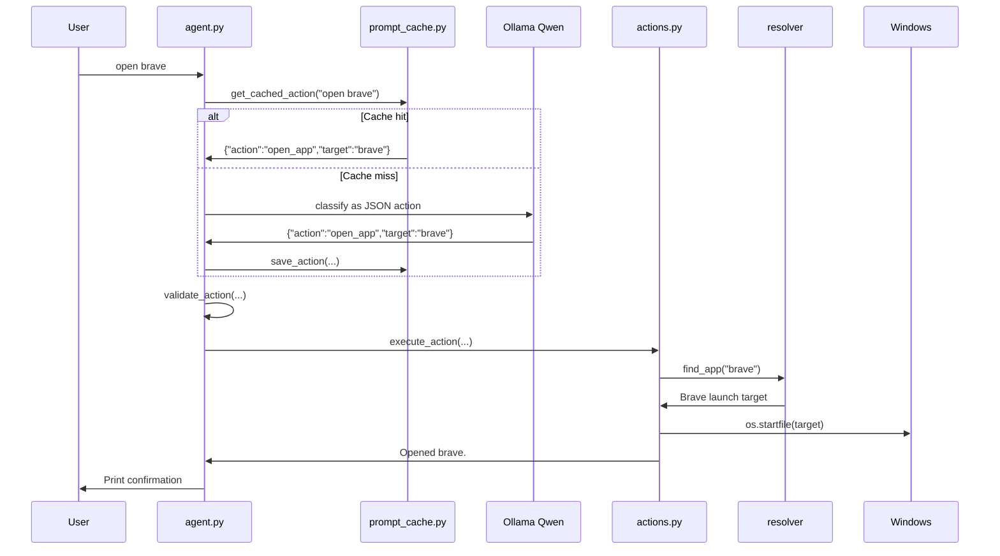

# Personal Agent Codebase Walkthrough

This repository is a local-first Windows personal agent prototype. The current working version accepts typed commands or voice commands, uses a local Ollama/Qwen model to convert user text into one structured JSON action, and executes it through trusted Python code.

The current milestone is:

```text
typed/spoken command -> local LLM -> validated JSON action -> Windows executor -> confirmation
```

## Current File Map

```text
personal-agent/
  agent.py              Main CLI agent loop, Ollama call, JSON cleanup, validation.
  actions.py            Dispatches and executes the allowlisted desktop actions.
  app_resolver.py       Finds installed Windows applications and caches paths.
  folder_resolver.py    Finds known/custom folders and caches custom folder paths.
  prompt_cache.py       Caches prompt text -> validated action mappings.
  app_paths.json        Local cache of resolved app launch targets.
  folder_paths.json     Local cache of resolved custom folder paths.
  prompt_cache.json     Local cache of repeated user prompts.
  Modelfile             Ollama model recipe for qwen3-nothink.
  test_resolver.py      Interactive CLI test for app lookup only.
  desktop_actions.py   Focuses windows, performs OCR, clicks, types, and presses keys.
  voice_io.py          Wake-word listening, Faster Whisper, TTS, state, and voice logs.
  pet_ui.py             Optional Tkinter desktop pet driven by agent_state.json.
  record_test.py        Records a WAV file to diagnose microphone capture.
  list_mics.py          Lists available microphone devices.
  brain.py              Empty placeholder; LLM logic currently lives in agent.py.
  config.py             Empty placeholder for future settings.
  requirements.txt      Currently empty; dependencies are installed manually.
```

Generated files/folders such as `__pycache__/` and `.venv/` are not source design.

## High-Level Flow



The important safety shape is already correct: the model does not directly control Windows. It only returns a JSON action, and local Python code decides whether that action is allowed and how to execute it.

## `agent.py`

`agent.py` is the current main program.

Main responsibilities:

- Read typed user input in a loop.
- Ignore empty input.
- Exit on `exit`, `quit`, `stop`, or `bye`.
- Support `forget <phrase>` to remove a bad prompt cache entry.
- Check `prompt_cache.json` before calling the LLM.
- Ask the local Ollama model for a JSON action on cache miss.
- Clean the model response defensively.
- Parse and validate the JSON action.
- Save newly validated actions to the prompt cache.
- Execute the action through `actions.execute_action`.

`main()` also supports `--voice`, `--mic INDEX`, and `--list-mics`. Voice mode
uses the same `process_command()` pipeline as typed mode, so validation,
caching, and execution are shared.

Current model:

```python
MODEL = "qwen3-nothink"
```

The file expects that this model has been created from `Modelfile`:

```powershell
ollama create qwen3-nothink -f Modelfile
```

## Agent Command Flow



## LLM Output Contract

The model is instructed to output exactly one JSON object.

Supported actions:

```json
{"action":"open_app","target":"brave"}
```

```json
{"action":"open_folder","target":"downloads"}
```

`validate_action()` currently allows:

```python
ALLOWED_ACTIONS = {
    "open_app",
    "open_folder",
  "focus_app",
  "close_app",
  "click_text",
  "type_text",
  "press_key",
  "wait",
}
```

Each desktop action must include a non-empty string `target`, **except**
`close_app`, whose `target` is optional — an empty target (or a pronoun like
"it"/"this window") means "close the currently-focused app". `wait` accepts a
non-negative number of seconds, including a numeric string.

## `Modelfile`

`Modelfile` creates a local Ollama model based on `qwen3:4b`.

It bakes in a strict JSON-only system instruction and sets deterministic generation:

```text
FROM qwen3:4b
PARAMETER temperature 0
PARAMETER num_predict 80
```

The goal is speed and consistency, not creativity.

## `prompt_cache.py`

`prompt_cache.py` avoids unnecessary LLM calls for repeated commands.

It stores:

```text
normalized user prompt -> validated action
```

Normalization is deliberately strict:

```python
return re.sub(r"\s+", " ", text.strip().lower())
```

There is no fuzzy matching here. That is a good safety choice because a wrong prompt-cache hit could execute the wrong action.

Prompt cache flow:



## `actions.py`

`actions.py` is the trusted execution layer.

Public functions:

```python
open_app(app_name: str) -> str
open_folder(folder_name: str) -> str
focus_app(app_name: str) -> str
close_app(target: str = "") -> str
click_text(target_text: str) -> str
type_text(text: str) -> str
press_key(key: str) -> str
wait(seconds) -> str
execute_action(action: dict) -> str
```

`execute_action()` dispatches only known action types:

```text
open_app    -> open_app(target)
open_folder -> open_folder(target)
focus_app   -> focus_app(target)
close_app   -> close_app(target)   # target optional; "" => current window
click_text  -> click_text(target)
type_text   -> type_text(target)
press_key   -> press_key(target)
wait        -> wait(target)
```

Both `open_app()` and `open_folder()` use the same self-healing pattern:

1. Resolve the target.
2. Try `os.startfile(path)`.
3. If launch fails, force a rescan.
4. Try once more.
5. Return a readable success/failure message.

Action execution flow:



## `app_resolver.py`

`app_resolver.py` resolves application names to launchable Windows targets.

Main public functions:

```python
find_app(app_name: str, force_rescan: bool = False)
forget_app(app_name: str)
```

Search order:

1. `app_paths.json` cache.
2. Known install locations.
3. Start Menu shortcuts.
4. Windows PATH.
5. PowerShell `Get-StartApps`.
6. Windows uninstall registry.

App resolver flow:



Supported launch target types:

- Normal executable path.
- Start Menu `.lnk` shortcut.
- `.url` shortcut.
- `shell:AppsFolder\<AppID>` for Store/UWP-style apps.

Important current behavior: this file does not contain a separate alias map. Matching is based on normalization, whole-word token matching, and fuzzy matching only for names where both strings are at least 6 characters long.

## App Name Matching



This avoids many short-name false positives such as matching `brave` with `rave`.

## `folder_resolver.py`

`folder_resolver.py` resolves folder names to real directories.

Main public functions:

```python
find_folder(folder_name: str, force_rescan: bool = False)
forget_folder(folder_name: str)
```

Search order:

1. Known Windows folders.
2. `folder_paths.json` cache.
3. Common user locations.
4. Full drive scan as a last resort.

Known folders include:

```text
downloads
documents
desktop
pictures
music
videos
home
user
appdata
local appdata
roaming
```

Custom folder search now limits common-location scanning to:

```python
MAX_COMMON_SEARCH_DEPTH = 3
```

It also skips noisy/system/cache folders:

```text
windows
$recycle.bin
system volume information
node_modules
.git
programdata
appdata
program files
program files (x86)
.cache
.venv
__pycache__
codex-runtimes
```

Folder resolver flow:



## `test_resolver.py`

`test_resolver.py` is an interactive test program for `app_resolver.py`.

Supported commands:

```text
<app name>          Resolve an app normally.
rescan <app name>   Ignore cache and search again.
forget <app name>   Remove app from app_paths.json.
quit / exit         Stop the test program.
```

It does not test folders or the full agent loop.

## Voice Input and Desktop Pet

`voice_io.py` keeps one microphone stream open while it listens for the wake
word `agent`. It calibrates ambient noise, transcribes WAV bytes with Faster
Whisper (`base.en`, CPU/int8), filters likely non-speech and filler
hallucinations, accepts common wake-word aliases, and passes commands into
`agent.process_command()`. It uses pyttsx3 for replies and drains buffered
audio after each command so the agent does not immediately hear its own TTS.

The default microphone follows the current Windows default input device.
`--mic INDEX` pins one device. The loop detects default-device changes and
reconnects automatically. `agent_state.json` carries `idle`, `listening`,
`thinking`, and `speaking` states. `pet_ui.py` polls this file and animates an
optional always-on-top Tkinter overlay. `voice_log.json` records heard phrases,
commands, and spoken responses.

## Cache Files

The JSON files are local machine state, not portable app configuration.

### `app_paths.json`

Stores app launch targets:

```json
{
  "brave": {
    "path": "C:\\ProgramData\\Microsoft\\Windows\\Start Menu\\Programs\\Brave.lnk",
    "last_verified": "2026-08-18",
    "launch_count": 10
  }
}
```

### `folder_paths.json`

Stores custom folder paths. It is currently empty:

```json
{}
```

Known Windows folders bypass this cache.

### `prompt_cache.json`

Stores prompt classifications:

```json
{
  "open brave": {
    "action": {
      "action": "open_app",
      "target": "brave"
    },
    "last_used": "2026-08-19",
    "hit_count": 2
  }
}
```

### `agent_state.json` and `voice_log.json`

`agent_state.json` is the small state channel used by voice mode and the pet.
`voice_log.json` is an append-only activity log for recognized speech and TTS
responses. These files may contain personal activity and should be reviewed
before sharing.

## Current MVP Sequence



## What Is Working Now

The current project can:

- Accept typed commands in a CLI loop.
- Use a local Ollama/Qwen model for JSON action classification.
- Cache repeated prompt classifications.
- Validate allowed action types before execution.
- Open Windows applications.
- Open known Windows folders.
- Search for custom folders.
- Cache app and custom folder paths.
- Rescan stale app/folder paths once if launch fails.
- Forget bad prompt and resolver cache entries through helper functions.
- Focus running applications and protect click/type/key actions from acting in
  an untracked foreground window.
- Capture voice commands, speak responses, and expose state to the desktop pet.
- Use OCR to find visible text and simulate clicks, typing, and key presses.

## Not Yet Built

The current project does not yet include:

- Long-term memory database.
- Skill/workflow recording.
- Sandbox mode.
- Permission levels beyond action validation.
- Confirmation dialogs, undo, authentication, remote control, or
  multi-user isolation.

## Known Cleanup Notes

- `brain.py` is empty even though the LLM logic currently lives in `agent.py`. Later, moving model/classification code into `brain.py` would make the structure cleaner.
- `requirements.txt` is empty even though the project uses multiple runtime
  dependencies; the parent README documents the current manual install.
- Some console strings contain mojibake characters from encoding issues. They do not block execution, but they make terminal output look corrupted.
- The local `.venv` appears broken on this machine. Syntax verification was done with Codex's bundled Python instead.

## Recommended Next Build Step

The next clean step is to split responsibilities without changing behavior:

```text
agent.py -> input loop and orchestration
brain.py -> ask_qwen, JSON cleanup, validate_action
actions.py -> trusted execution
```

After that, declare and pin the runtime dependencies in `requirements.txt`,
then add focused automated tests around validation, cache behavior, resolver
matching, and voice parsing. Hardware-dependent OCR, microphone, and window
focus behavior should remain covered by the existing manual diagnostics.
